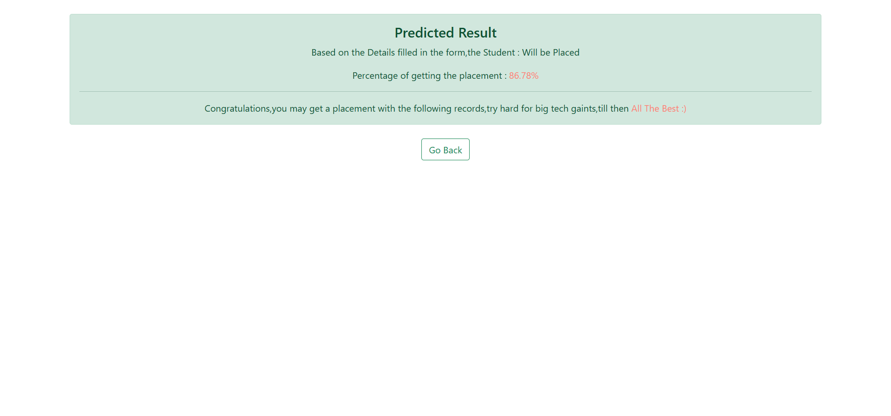

# 🎓 Campus Placement Predictor using Flask & Machine Learning


This repository hosts a **Campus Placement Predictor** built with **Flask**, **Pandas**, and **Scikit-learn**. It predicts whether a student is likely to be placed based on academic and profile parameters. The project also includes a **Jupyter Notebook** that explains data preprocessing, EDA, model training, and evaluation.

---

## 📁 Project Structure

```
📦Campus-Placement-Predictor/
├── app.py                                # Flask web app
├── CPP.pkl                               # Trained Random Forest model
├── Placement_Data_Full_Class.csv         # Dataset used for training
├── Campus Placement Predictor.ipynb      # Notebook with full ML pipeline
├── requirements.txt                      # Python dependencies
├── templates/
│   ├── index.html                        # Homepage form for input
│   └── show.html                         # Output/result page
├── static/
│   └── style.css                         # (Optional) Custom styles
├── CPP_SS_1.png                          # Screenshot: Input form
├── CPP_SS_2.png                          # Screenshot: Prediction result
└── README.md                             # Project documentation
```

---

## 🚀 Features

- 🎯 Predicts whether a student will be placed based on:
  - Gender
  - Specialization
  - Work Experience
  - SSC, HSC, Degree %, MBA %
- 📊 Displays probability of placement
- 🧠 Random Forest Classifier trained on real-world campus data
- 🌐 Fully deployed on local Flask server

---

## 📊 Dataset Description

- **Source:** Supplied dataset (`Placement_Data_Full_Class.csv`)
- **Size:** 215 rows × 15 columns
- **Features used:**
  - Gender (binary)
  - Stream/Specialization (binary)
  - Work Experience (binary)
  - SSC %, HSC %, Degree %, MBA %
- **Target:** Placement status (Placed / Not Placed)

---

## 🧠 ML Model Details

- **Model:** Random Forest Classifier
- **Libraries Used:** Scikit-learn, Pandas, NumPy, Seaborn
- **Evaluation Metrics:** Accuracy, Confusion Matrix, ROC Curve
- **Best Accuracy Achieved:** 87.5%

---

## 💻 How to Run the App Locally

### 🔧 Clone the Repository

```bash
git clone https://github.com/sg2499/Campus-Placement-Predictor.git
cd Campus-Placement-Predictor
```

### 🐍 Set up a Virtual Environment

```bash
conda create -n cpp_env python=3.11
conda activate cpp_env
```

### 📦 Install Dependencies

```bash
pip install -r requirements.txt
```

### ▶️ Run the Flask App

```bash
python app.py
```

App will run locally at:  
📍 `http://127.0.0.1:5000`

---

## 📸 UI Screenshots

#### 🟢 Home Page – Input Form


#### 🟢 Result Page – Placement Prediction


---

## 📄 Sample Input

| Gender | Spec | Tech | Work | SSC | HSC | Degree | MBA |
|--------|------|------|------|-----|-----|--------|-----|
| 1      | 0    | 1    | 1    | 78.6| 70.5| 72.1   | 65.3|

**Output:** ✅ *Will be Placed* with 82.4% probability

---

## 🧪 Dependencies

```txt
Flask==1.1.1
gunicorn==19.9.0
Jinja2==2.11.3
numpy>=1.9.2
pandas>=0.19
scikit-learn>=0.18
matplotlib>=1.4.3
seaborn>=0.9.1
```

> 📦 Full list in [`requirements.txt`](requirements.txt)

---

## ✍️ Author

Created with ❤️ by **Shailesh Gupta**  
🔗 GitHub: [sg2499](https://github.com/sg2499)  
📩 Email: shaileshgupta841@gmail.com

---

> Empowering students with the right tools for career prediction 🌟